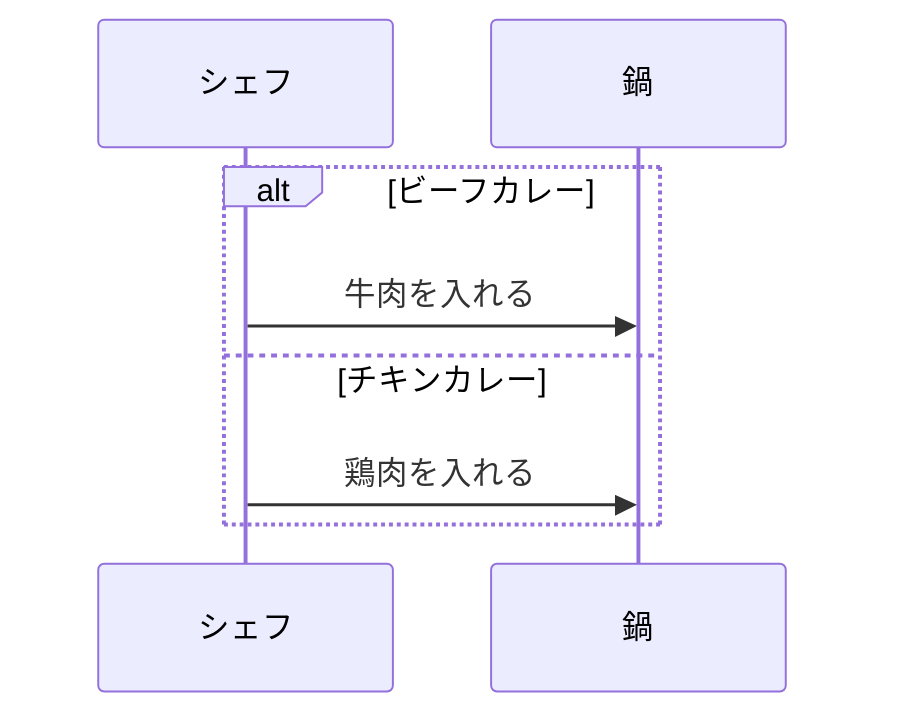
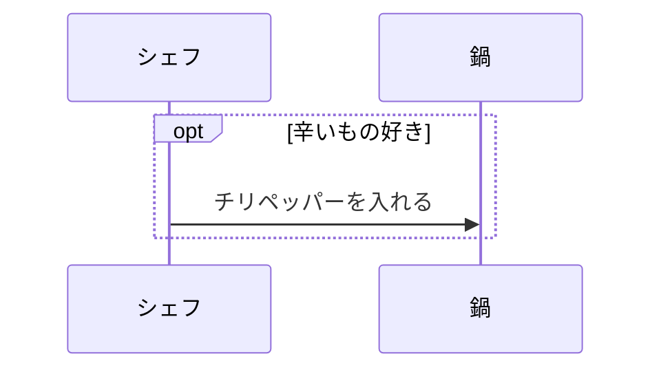
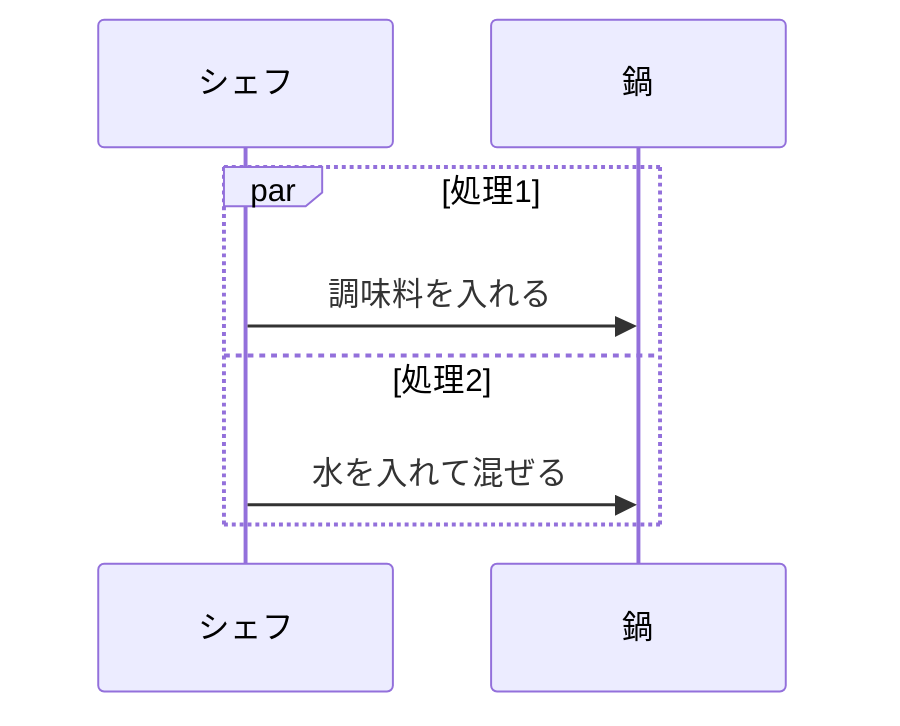
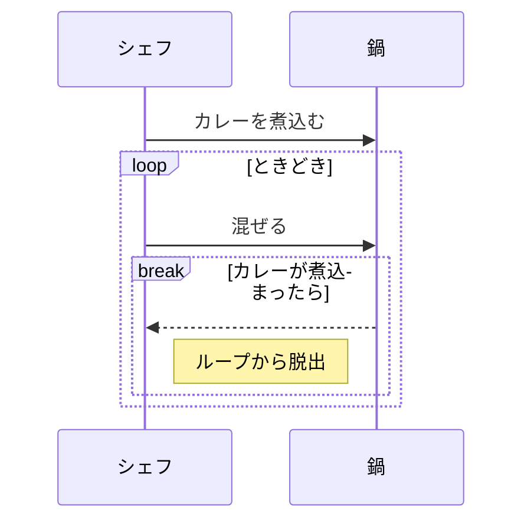
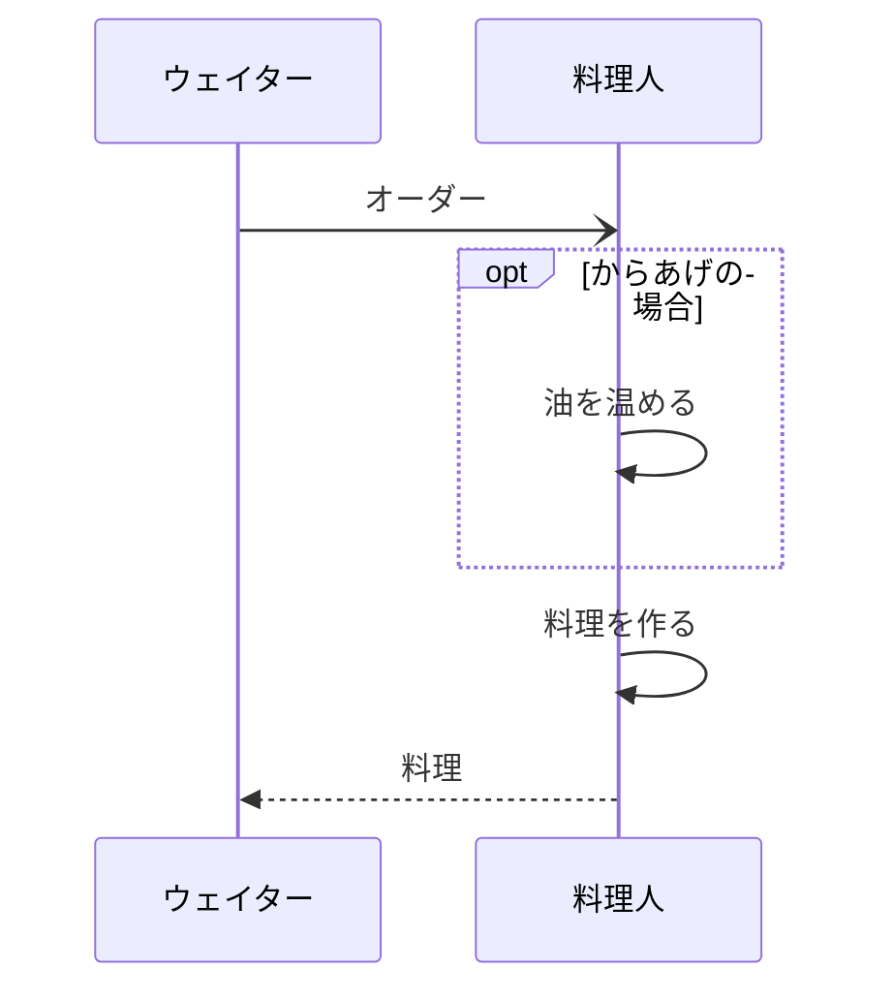

# alt

# opt

# par

# loop & break

|  結合フラグメント   |  正式名称   |   表現内容  |
| --- | --- | --- |
|alt   |  alternative   |  分岐処理   |
|opt	|option|	実行の可否の選択|
|loop|	option|	繰り返し|
|break|	break|	処理の中断|
|par|	parallel|	並行|
|seq|	weak sequencing|	同じライフラインから送信されるメッセージの順序を保証|
|strict	|strict sequencing|	全てのライフラインから送信されるメッセージの順序を保証|
|critical|	critical region|	クリティカル領域(セクション)|
|ignore|	ignore	|実行時に無視されるメッセージの指定|
|consider|	consider|	ignoreの逆|
|neg|	negative|	無効な領域|
|assert|assert	|メッセージ実行後に成立するべき条件の指定|

# 練習

